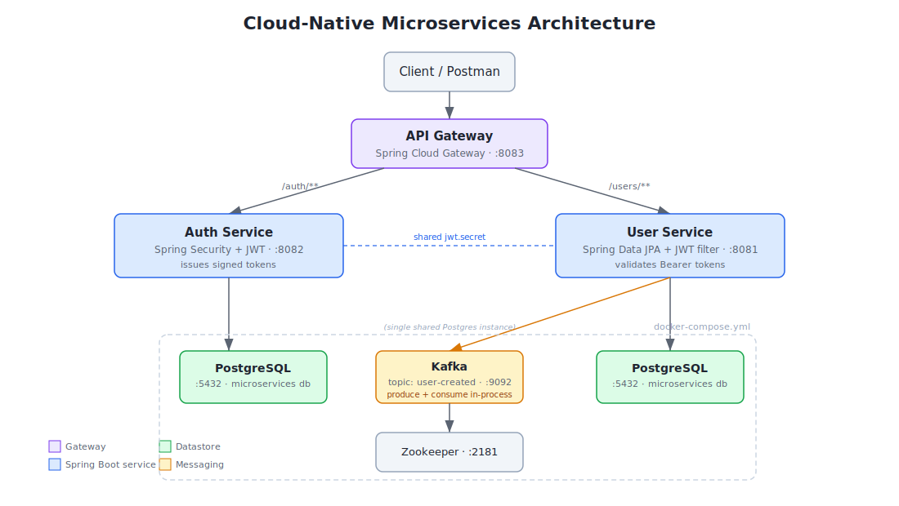

# Cloud-Native Microservices Boilerplate

A Spring Boot microservices reference project demonstrating a JWT-secured REST API, event-driven messaging with Kafka, an API gateway, and a containerized local development stack — built end-to-end as a portfolio piece to practice the patterns behind production-grade distributed systems.

## Overview

This project is a three-service architecture: an **API Gateway** that routes traffic, an **Auth Service** that issues JSON Web Tokens, and a **User Service** that owns user data and publishes domain events to Kafka whenever a user is created. All three services are independently runnable Spring Boot applications that share a Postgres database instance and a Kafka broker for asynchronous messaging.

The goal was to go beyond a single CRUD app and actually wire up the pieces that make a system "cloud native": service-to-service authentication, an event bus, externalized configuration, containerized infrastructure, and a CI pipeline that builds on every push.

## Architecture



A request from the client hits the API Gateway, which forwards it to either the Auth Service or User Service based on the path. The Auth Service issues a signed JWT on login; the User Service validates that same token (using a shared secret) before allowing access to its endpoints. When a new user is created, the User Service publishes a `user-created` event to Kafka, which it also consumes in-process — a stand-in for what would eventually be a separate downstream consumer (e.g. a notifications or analytics service).

## Features

- **JWT authentication** — the Auth Service issues tokens; the User Service validates them with a custom `OncePerRequestFilter` and returns a proper `401` JSON body on missing or invalid tokens
- **Event-driven messaging** — Kafka producer/consumer wired into the User Service for the `user-created` topic
- **API Gateway** — Spring Cloud Gateway routes `/auth/**` and `/users/**` to their respective services
- **Persistence** — Spring Data JPA against PostgreSQL, with Hibernate managing schema via `ddl-auto=update`
- **Containerized infrastructure** — Postgres, Kafka, and Zookeeper run via Docker Compose; only the application services run locally in the IDE
- **CI pipeline** — GitHub Actions builds all three services with Maven on every push to `main`

## Tech stack

| Layer | Technology |
|---|---|
| Language / runtime | Java 21 |
| Framework | Spring Boot 3.5, Spring Cloud Gateway |
| Security | Spring Security, JJWT (`io.jsonwebtoken`) |
| Persistence | Spring Data JPA, PostgreSQL 16 |
| Messaging | Apache Kafka 7.5 (Confluent images), Zookeeper |
| Build | Maven |
| Containers | Docker Compose |
| CI | GitHub Actions |

## Project structure

```
cloud-native-microservices-boilerplate/
├── api-gateway/          # Spring Cloud Gateway, routes requests
├── auth-service/         # Issues JWTs on login
├── user-service/         # User CRUD, JWT validation, Kafka producer/consumer
├── docs/
├── docker-compose.yml    # Postgres + Kafka + Zookeeper
└── .github/workflows/ci.yml
```

## Getting started

### Prerequisites

- Java 21 JDK
- Maven
- Docker Desktop
- An IDE (Eclipse, IntelliJ, or VS Code)

### 1. Start the infrastructure

```bash
docker compose up -d
```

This brings up PostgreSQL (`:5432`), Zookeeper (`:2181`), and Kafka (`:9092`). Kafka images are pinned to `7.5.0` rather than `latest` — newer Confluent images default to KRaft mode and require a different set of environment variables (`KAFKA_PROCESS_ROLES`), which breaks this Zookeeper-based setup.

### 2. Build and run each service

From the project root:

```bash
cd auth-service && mvn clean install -DskipTests
cd ../user-service && mvn clean install -DskipTests
cd ../api-gateway && mvn clean install -DskipTests
```

Then run each service's main class from your IDE, or with `mvn spring-boot:run` in each folder. Default ports:

| Service | Port |
|---|---|
| Auth Service | 8082 |
| User Service | 8081 |
| API Gateway | 8083 |

### 3. Try it out

Get a token:
```bash
curl -X POST http://localhost:8082/auth/login \
  -H "Content-Type: application/json" \
  -d '{"username": "alice"}'
```

Use it to access a protected endpoint:
```bash
curl http://localhost:8081/users \
  -H "Authorization: Bearer <token from above>"
```

Or route everything through the gateway on `:8083` instead of hitting services directly.

## Known limitations

This is a learning/portfolio project, not a production system. A few simplifications worth calling out:

- The Auth Service issues a token for any username with no real credential check — there's no password, no user store lookup. Adding that is a natural next step.
- The API Gateway does not itself validate JWTs; it forwards everything and lets each downstream service enforce its own security. A production setup would likely centralize that check at the gateway.
- Both services share one Postgres instance and one `jwt.secret` value via local `application.properties` files rather than a secrets manager — fine for local dev, not for production.
- The Kafka consumer logs the event to stdout rather than doing anything with it; it's there to demonstrate the producer/consumer wiring, not as a complete feature.

## License

This project is provided as-is for educational and portfolio purposes.
